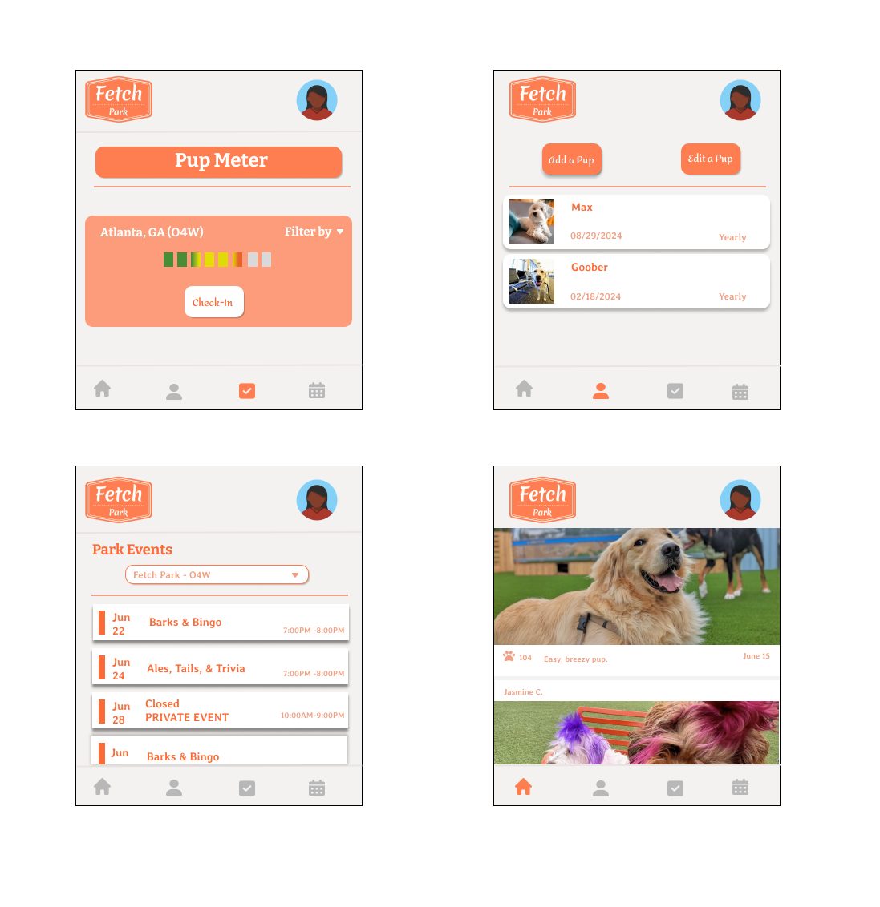

# FETCH 

#### A full-stack web application built as a second project. 

## DESCRIPTION 
Fetch is an application designed to allow members of Fetch park to create profiles for their dogs in a more streamlined and seamless manner. 

## TABLE OF CONTENTS
* [Technologies Used](#technologiesused)
* [Features](#features)
* [Design](#design)
* [Future Features](#futurefeatures)
* [Deployed App](#deployment)
* [About the Author](#author)

## TECHNOLOGIES USED: 
* HTML5 
* CSS3 
* JavaScript 
* MongoDB 
* EJS Partials 

## FEATURES
* Users can create a profile for their dog(s) as well as edit, delete, or update their profiles. 

## Jira Planning 
* https://rachelramoutar.atlassian.net/jira/software/projects/FA/boards/1

## DESIGN
* Design elements implemented using HTML5 and CSS3.
* Wireframes: 

## FUTURE FEATURES
* Allow users to upload photos of themselves and their pet
*  Users can create a profile for themselves to begin using the app as well as edit, delete, or update their profiles.
* Users can view the how busy a location is at any given time 
* Users can check into a location 

## DEPLOYED APP 
The Fetch App can be accessed via this link: [Github.com](https://github.com/rachelramoutar/Fetch-App.git)

## ABOUT THE AUTHOR

A native of Trinidad, Rachel Ramoutar immigrated with her family to the US when she was 12. Her love of figuring out puzzles, moving around, and strong logistics skills landed her in the film industry. After 6 years, in a post-Covid world, she took the first steps to developing an app. As for tech experience, she had none, so in an effort to speak the same language as her soon-to-be developing team, she began teaching herself the software engineering basics. What followed was a spark ignited for the creativity and structure of the tech world. She is currently a student at General Assembly, is still establishing her app, and hopes to obtain MVP by the end of 2024. 

